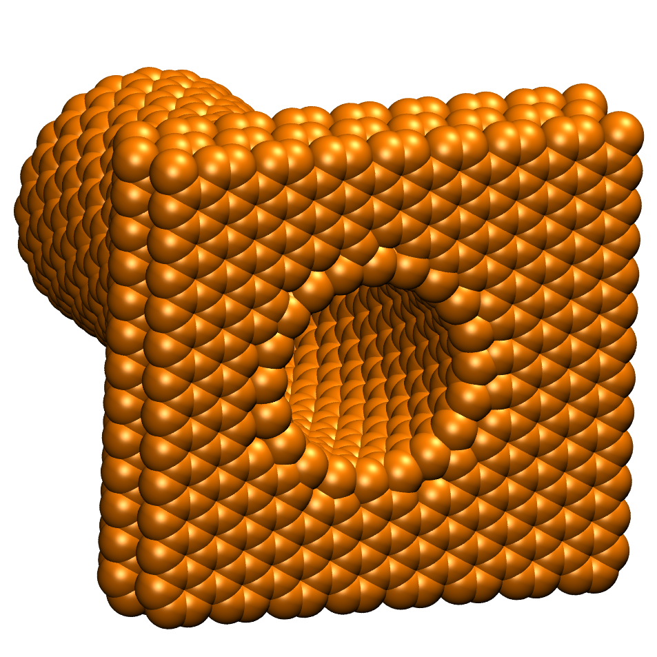
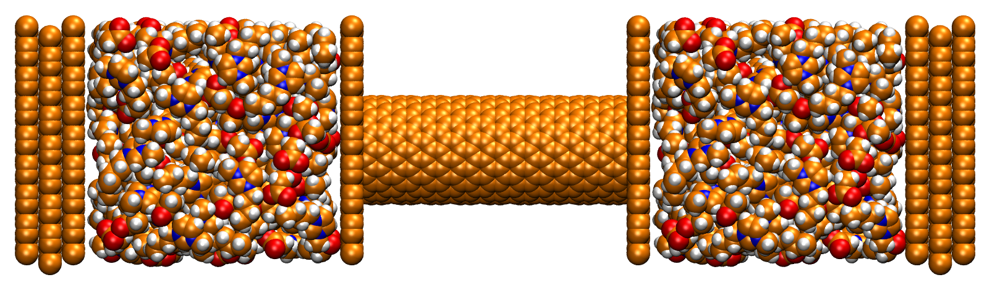

CONAn - User Guide
===================================

.. note::

   This project is under active development.

**CONAn** is a tool to generate carbon structures, set up MD simulation boxes and analyze MD trajectories composed of a liquid and carbon structures.
The program has the following features:

* Generate carbon structures like carbon walls, carbon nanotubes (CNT) or pores.

.. image:: pictures/carbon_wall.png
   :width: 24%
   :alt: Wall

.. image:: pictures/CNT.png
   :width: 24%
   :alt: CNT

.. image:: pictures/pore_tilted.png
   :width: 24%
   :alt: Pore

* Set up systems with a bulk liquid input file and carbon structures of choice.

-> include a picture of the system here

* Identify and characterize carbon structures found in a trajectory.
* Calculate the radial density inside a CNT.
* Calculate the accessible volume of a CNT.
* Calculate the axial density along a simulation box.
* Produce xyz files of a frame/pore/CNT (either filled with liquid or empty) from the trajectory.

Additionally the program has a molecule identifier implemented, which makes it possible to perform all analysis for the individual kind of molecules present in the system.

Check out the :doc:`first_steps/Installation` for more information on how to install CONAn.

.. toctree::
   :caption: First Steps
   :maxdepth: 2

   first_steps/Installation
   first_steps/input_output

.. toctree::
   :caption: Simulation Setup
   :maxdepth: 2

   simulation_setup/cbuilder
   simulation_setup/simulation_box

.. toctree::
   :caption: Picture Mode
   :maxdepth: 2

   pic_mode/picture_mode

.. toctree::
   :caption: Analysis
   :maxdepth: 2

   analysis/mol_ident
   analysis/acc_volume
   analysis/dens_prof

.. toctree::
   :caption: Other
   :maxdepth: 2

   other/versions
   other/imprint
   other/privacy_policy