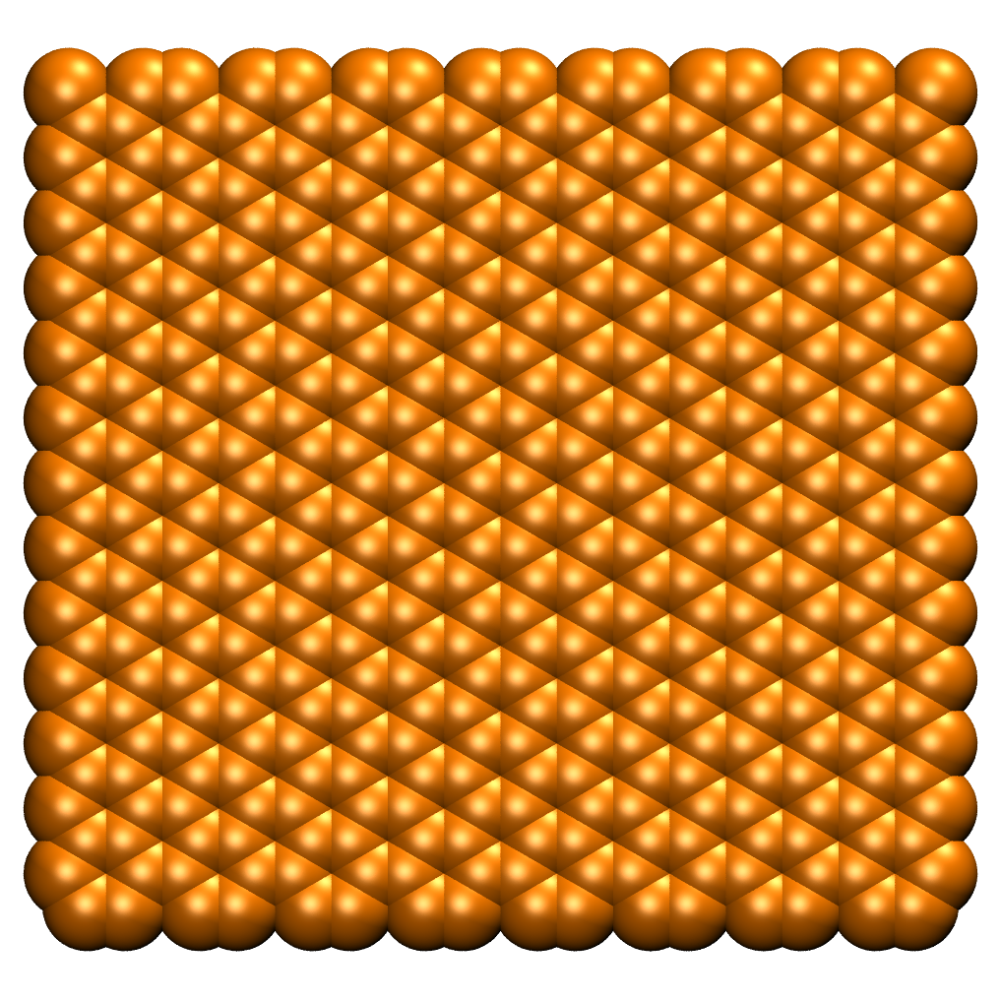
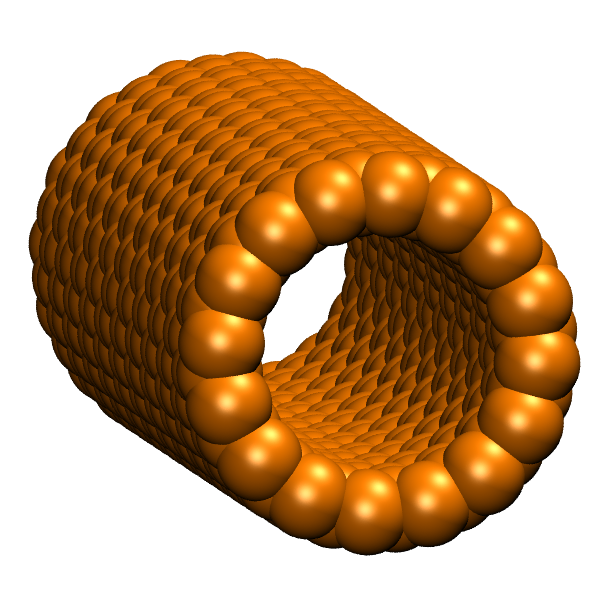
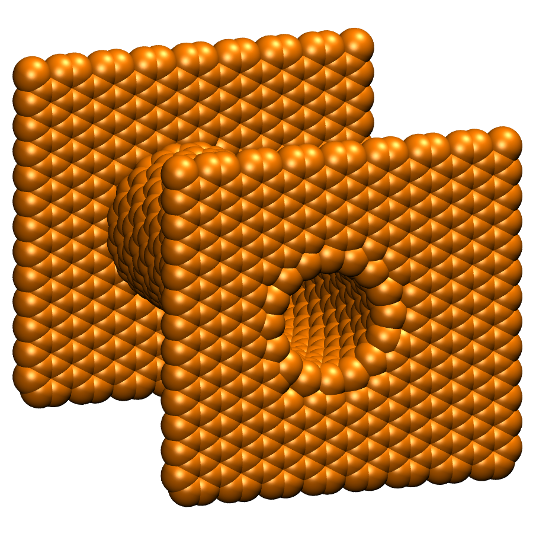
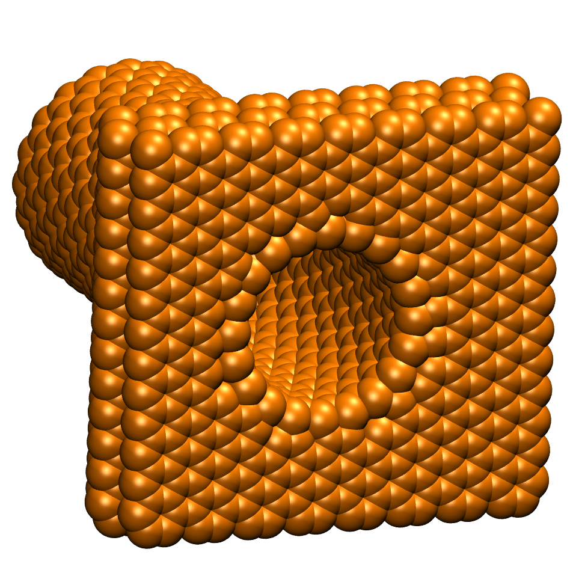

Carbon structures
=================

This mode is automatically started, when the '-c' flag is given while starting the program.
.. code-block::
    
    $ python3 CONAn.py -c

The mode is used to build new carbon structures from scratch and print the xyz structures to a file.

The program is able to build the following structures:

* Carbon nanotubes (CNTs) with length and radius of choice.
* Carbon walls with size in x and y direction of choice. Multiple layers can be constructed.
* The CNTs and carbon walls can be combined to build a 'pore' structure. 
Either as an open tube with walls on either side, or closed on one side, having a wall on one the other side.

The structures are built by using the following parameters:

* The set carbon-carbon distance is 1.42 Angstrom.
* The interlayer distance between carbon layers is set to 3.35 Angstrom.
  The layers are shifted with respect to each other, resulting in an ABA stacking.
* CNTs are produced in the zig-zag conformation.
* All structures are set up in such a way, that periodic boundary conditions are satisfied.

The carbon-carbon distance and the interlayer distance between carbon layers can be adjusted by the user.
All relevant quantities are printed to the terminal and the ``conan.log`` file, the xyz structures are written to a seperate file.

