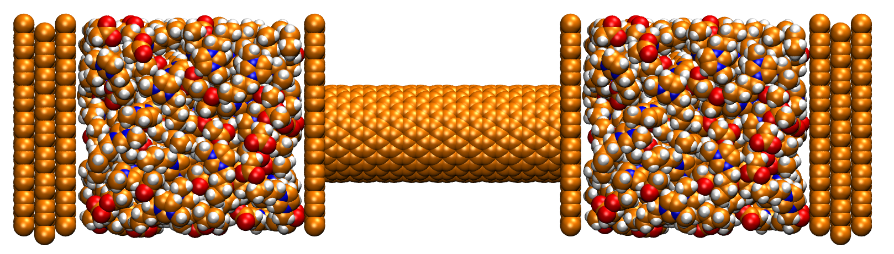

Simulation Box Generator
========================

A simulation box can be generated by using the '-b' flag in the command line.
.. code-block::
    
    $ python3 CONAn.py -b

With the simulation box mode activated, the user will be prompted to enter a string of letters to describe how the box should be set up.

.. list-table:: Simulation Box Generator
   :widths: 25 25 50
   :header-rows: 1

   * - Letter
     - Description
     - File name
   * - B
     - Liquid bulk
     - bulk.xyz
   * - W
     - Carbon Wall
     - carbon_wall.xyz
   * - P
     - Pore structure
     - pore.xyz
   * - L
     - Left pore structure
     - pore_left.xyz
   * - R
     - Right pore structure
     - pore_right.xyz

The 'L' and 'R' keywords are needed, if the pore structure is not symmetric and therefore two different pores want to be introduced.
The provided xyz structures have to be in the folder where the program is executed, or in the cbuild folder generated beforehand. 
The final simulation box will be saved as simbox.xyz in the present folder.

    Simulation box of an ionic liquid between carbon walls and a pore, generated with the simulation box generator.
   

